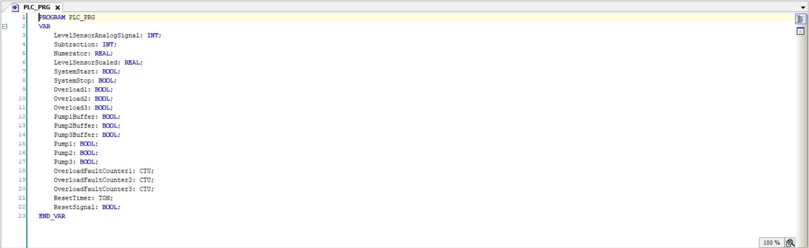
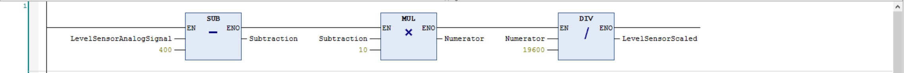
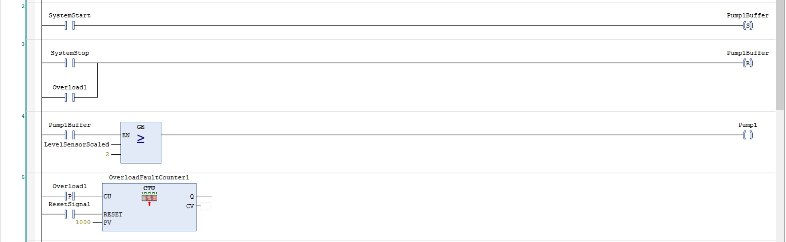
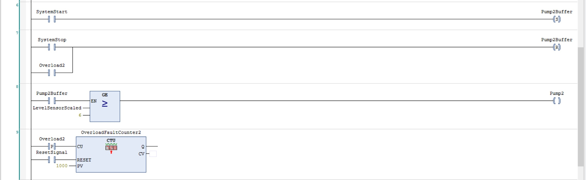
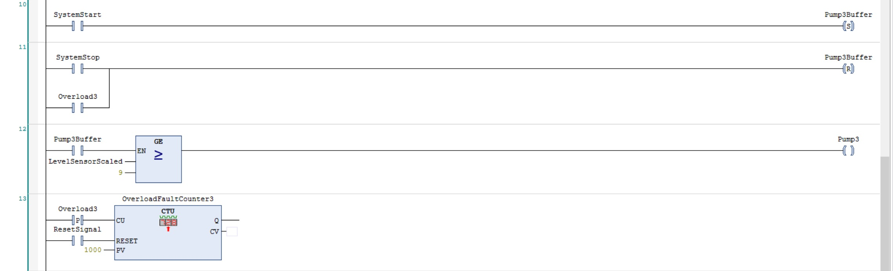
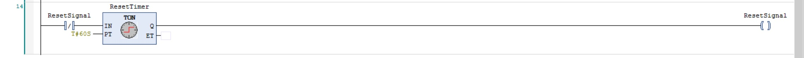

# Water treatment with hydrostatic level sensor

## Project Overview
This repository contains the project for managing a water deposit with a height of 10 meters. The system utilizes three pumps to distribute water to a village, and the distribution is based on the water level in the deposit. An analog hydrostatic level sensor measures the water level.

## System Operation
- Water Level < 2m: No pump engages.
- Water Level [2-5]m: First pump engages.
- Water Level [6-8]m: First and second pumps engage.
- Water Level [9-10]m: All three pumps engage.

The system also includes:
- Start and Stop Push-buttons
- Pump Overload Protection: Each pump's overload signal is monitored by the PLC. In case of an overload, only the corresponding pump stops.
- Fault Log: Each pump records the number of faults, with logs resetting every 3 days (simulated to reset every 1 minute for testing).
- Analog Sensor Calibration: The analog sensor signal is scaled from [400-20000] to [0-10] meters.

## Technology Stack
This project is implemented using:
- **Ladder Logic**: The control logic for the water distribution system is designed using ladder logic diagrams.
- **CODESYS**: The project is developed and simulated using CODESYS, a leading development environment for programming industrial controllers.

## Preview
### Textual view

### Scaling of the analog signal sensor

### Pump one

### Pump two

### Pump three

### Timer

